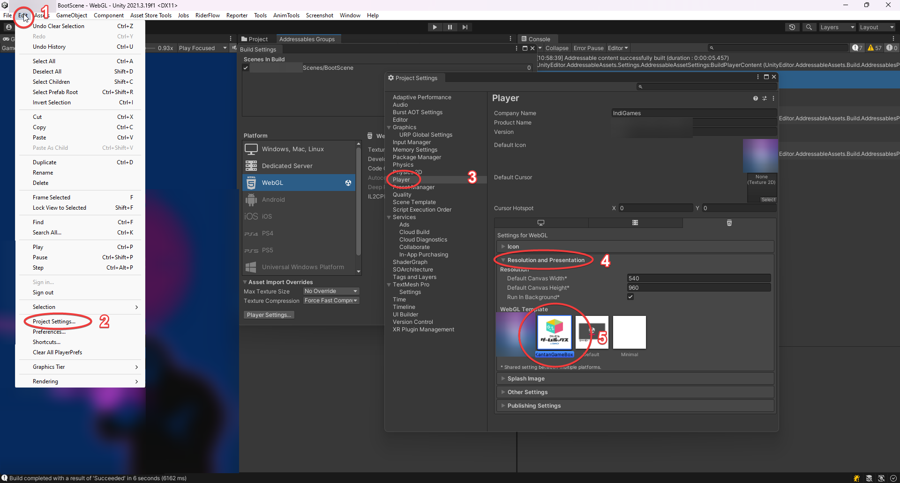

# Kantan GameBox WebGL Template

Only using template for Kantan GameBox

# Depiction Page
[Cooperation of Unity and KantanGameBox - Kiharu Shishikura ](https://note.com/preview/n14585b070ff7?prev_access_key=d4d9ef0fa9d182f0660b2c26baad1cf6)

# How to use

### Requirements
1. KantanGameBox Template (Package)
2. KantanGameBox Plugins
3. ~~KantanGameBox Scripts (Package)~~

### TO DO!!

After install template - go to **Project Settings** (Edit - > Project Settings -> Player -> Resolution and Presentation) you will see **KantanGameBox** template.

